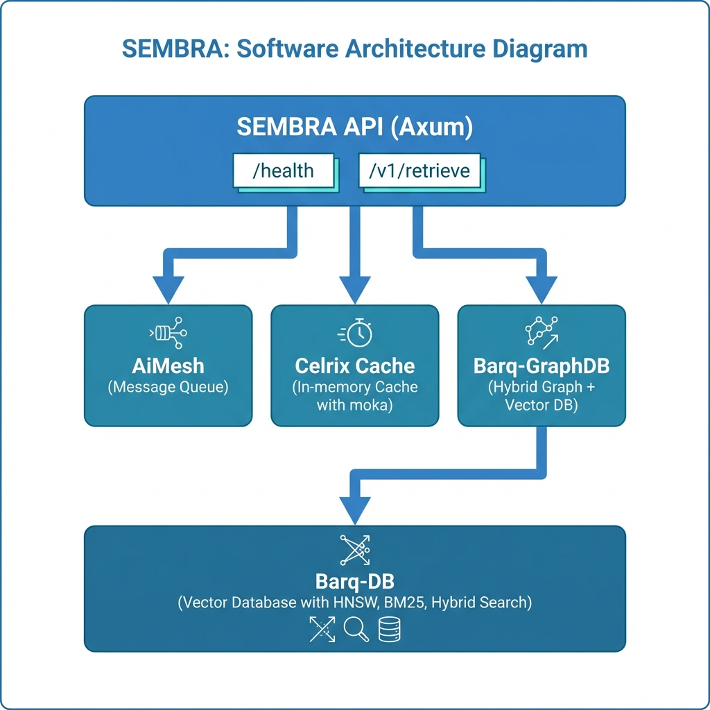

<p align="center">
  
</p>

<h1 align="center">SEMBRA</h1>

<p align="center">
  <strong>Semantic Search & Document Retrieval Engine</strong>
</p>

<p align="center">
  <a href="#features">Features</a> •
  <a href="#architecture">Architecture</a> •
  <a href="#quick-start">Quick Start</a> •
  <a href="#api">API</a> •
  <a href="#docker">Docker</a>
</p>

---

## Overview

SEMBRA is a high-performance document retrieval system that integrates with [Barq-DB](https://github.com/YASSERRMD/barq-db) for vector search, [Barq-GraphDB](https://github.com/YASSERRMD/barq-graphdb) for graph relationships, and [AiMesh](https://github.com/YASSERRMD/AiMesh) for message queue orchestration. Built with Rust for maximum performance.

## Features

- **Hybrid Search** - Combines vector embeddings with BM25 via Barq-DB
- **High Performance** - Sub-100ms search latency with Celrix in-memory caching (moka)
- **Graph Relationships** - Document relationships via Barq-GraphDB with hybrid queries
- **Message Queue** - AI agent orchestration via AiMesh
- **REST API** - Clean axum-based API with `/health` and `/v1/retrieve` endpoints
- **Docker Ready** - Production deployment with Barq-DB, Barq-GraphDB, and AiMesh containers

## Architecture



## Quick Start

### Prerequisites

- Docker & Docker Compose

### Run Everything

```bash
cd docker
docker-compose up -d
```

This starts all services:
- **Barq-DB** on port 8080
- **Barq-GraphDB** on port 8081
- **AiMesh** on port 9000
- **Redis** on port 6379
- **SEMBRA API** on port 3000

### Test the API

```bash
curl http://localhost:3000/health
```

### Development Build (Optional)

```bash
cd backend
cargo build --release
cargo test
```

## API

### Health Check

```bash
curl http://localhost:3000/health
```

Response:
```json
{
  "status": "healthy",
  "version": "0.1.0",
  "barq_db": "healthy",
  "barq_graphdb": "healthy"
}
```

### Retrieve Documents

```bash
curl -X POST http://localhost:3000/v1/retrieve \
  -H "Content-Type: application/json" \
  -d '{
    "query": "machine learning concepts",
    "top_k": 10,
    "query_embedding": [0.1, 0.2, ...]
  }'
```

Response:
```json
{
  "results": [
    {"id": 123, "score": 0.95, "payload": {...}},
    {"id": 456, "score": 0.89, "payload": {...}}
  ],
  "latency_ms": 45
}
```

## Docker

### Start All Services

```bash
cd docker
docker-compose up -d
```

Services:
- **Barq-DB** - Vector database (port 8080)
- **Barq-GraphDB** - Graph + Vector database (port 8081)
- **AiMesh** - Message queue (port 9000)
- **Redis** - Cache (port 6379)
- **SEMBRA API** - REST API (port 3000)

### Environment Variables

| Variable | Default | Description |
|----------|---------|-------------|
| `BARQ_DB_URL` | `http://localhost:8080` | Barq-DB connection |
| `BARQ_GRAPHDB_URL` | `http://localhost:8081` | Barq-GraphDB connection |
| `AIMESH_URL` | `http://localhost:9000` | AiMesh connection |
| `REDIS_URL` | `redis://localhost:6379` | Redis connection |

## Project Structure

```
sembra/
├── backend/
│   ├── sembra-api/        # REST API server
│   ├── sembra-core/       # AiMesh consumer
│   ├── sembra-cache/      # Celrix in-memory cache
│   ├── sembra-storage/    # Barq-DB client
│   ├── sembra-graph/      # Barq-GraphDB client
│   └── sembra-types/      # Shared types
├── docker/
│   ├── docker-compose.yml
│   ├── Dockerfile.api
│   └── Dockerfile.tests
└── assets/
    ├── logo.svg
    └── architecture.png
```

## External Dependencies

| Service | Repository | Docker Image |
|---------|------------|--------------|
| Barq-DB | [YASSERRMD/barq-db](https://github.com/YASSERRMD/barq-db) | `yasserrmd/barq-db` |
| Barq-GraphDB | [YASSERRMD/barq-graphdb](https://github.com/YASSERRMD/barq-graphdb) | `yasserrmd/barq-graphdb` |
| AiMesh | [YASSERRMD/AiMesh](https://github.com/YASSERRMD/AiMesh) | `yasserrmd/aimesh` |

## License

MIT License - see [LICENSE](LICENSE) for details.

---

<p align="center">
  Built with 🦀 Rust
</p>
